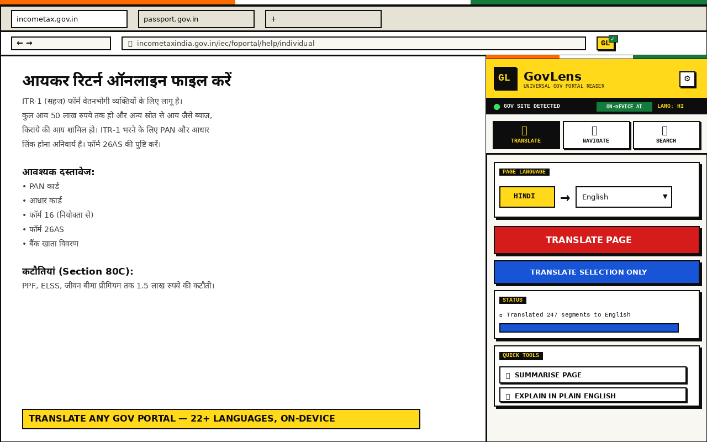

<div align="center">

# GovLens

### The bureaucratic web, finally readable.

A Chrome extension that overlays a universal reader on top of any government portal — read it in your language, see its full structure, search across languages.

[](https://github.com/sinhaankur/GovLens/actions/workflows/pages.yml)
[](./LICENSE)
[](https://github.com/sinhaankur/GovLens/releases)
[](#what-it-does)
[](#what-it-does)
[](./PRIVACY.md)

**🌐 [sinhaankur.github.io/GovLens](https://sinhaankur.github.io/GovLens/) · 📚 [User Guide](https://sinhaankur.github.io/GovLens/docs.html) · 🔒 [Privacy](https://sinhaankur.github.io/GovLens/privacy.html) · 📦 [Releases](https://github.com/sinhaankur/GovLens/releases)**

<br/>



</div>

---

## Why this exists

Government websites are some of the worst-built sites on the internet. They're slow, in the wrong language, full of unexplained acronyms, time you out mid-form, and bury what you actually need under five layers of menus. Hundreds of millions of people deal with that every year — to file taxes, apply for passports, claim benefits, register businesses.

GovLens doesn't fix gov sites. It overlays a layer that makes them usable.

---

## What it does

Four tools in one Chrome side panel that activates the moment you land on any government portal — Indian (`.gov.in`), UK (`.gov.uk`), US (`.gov`), Canadian (`.gc.ca`), EU (`.europa.eu`), Australian (`.gov.au`), and 19 more national TLDs.

| | | |
|---|---|---|
| 🌐 | **Translate** | Auto-detect the page language. Translate the whole page or just a selection into 100+ languages — including 80+ Indian regional / Adivasi / North-East languages and historic Kaithi & Tirhuta scripts. |
| 🗺 | **Navigate** | Every page section, every form (with field counts), every PDF, every nav menu — listed in one panel. Click anything to scroll there with a flash highlight. |
| 🔍 | **Search** | Cross-language search — type your query in any language. Click any result and the page scrolls to the *exact* Nth occurrence and pulses red for 4 seconds. |
| 📊 | **Score** | A 0–100 usability grade across 8 axes (accessibility, navigation, readability, mobile-friendliness, trust signals, etc.) with concrete fixes. History tracks improvements over time. |

Plus: region-aware jargon explainer (`PAN`, `GSTIN`, `HMRC`, `NIN`, `SSN`, `FAFSA`…), form auto-save with undo, AI summarise, retro floating Ctrl+F bar, searchable language picker.

---

## How translation works without an API key

Three-engine cascade. The side panel shows which one will answer **before** you click.

1. 🟢 **On-device AI** (Chrome 138+) — free, private, runs entirely on your machine
2. 🟡 **Google Translate** (free, internet) — covers the long tail of common languages
3. 🔵 **Anthropic Claude** (BYOK paid) — premium quality, handles transliteration of historic scripts (Kaithi, Tirhuta), works for any language via prompt

Most users never need an API key.

---

## Install

### From source (developer mode)

```bash
git clone https://github.com/sinhaankur/GovLens.git
```

1. Open `chrome://extensions`
2. Toggle **Developer mode** (top-right)
3. Click **Load unpacked** → select the `govlens-extension/` folder
4. Pin the GL icon to your toolbar
5. Visit any `.gov.in`, `.gov.uk`, `.gov`, etc. page → click GL

### From Chrome Web Store

*Submission in review (May 2026). Link will be added once approved.*

---

## Indian language depth

Most translators ship with the 22 scheduled languages and call it done. GovLens goes further:

| Tier | Languages |
|---|---|
| **22 Official (scheduled)** | Hindi, Bengali, Tamil, Telugu, Marathi, Gujarati, Kannada, Malayalam, Punjabi, Odia, Assamese, Urdu, Sanskrit, Kashmiri, Nepali, Konkani, Maithili, Sindhi, Bodo, Dogri, Manipuri, Santali |
| **Hindi belt regional** | Bhojpuri (~150M), Awadhi, Magahi, Chhattisgarhi, Marwari, Haryanvi, Bundeli, Kumaoni, Garhwali, Hindko, Rajasthani |
| **Bihar & Jharkhand** | Angika, Bajjika, Khortha, Surjapuri, Tharu, Pali |
| **West & South** | Tulu, Kodava, Bhili, Saurashtra, Badaga, Toda |
| **Tribal & Adivasi** | Gondi, Kurukh, Mundari, Ho, Kharia, Sauria Paharia, Ao Naga, Angami, Nyishi, Adi, Apatani |
| **North-East** | Mizo, Khasi, Kokborok, Garo, Dimasa, Karbi, Hmar |
| **Himalayan** | Ladakhi, Lepcha, Sikkimese, Balti, Torwali, Kashmiri Pahari |
| **Historic scripts** | **Kaithi 𑂍𑂶𑂘𑂲** (older Bhojpuri/Magahi/Maithili) · **Tirhuta 𑒞𑒱𑒩𑒯𑒳𑒞𑒰** (older Maithili) — AI transliterates to Devanagari then translates |

A vocabulary-based heuristic distinguishes Bhojpuri/Awadhi/Magahi/Maithili/Marathi from standard Hindi at detection time, since all five share the Devanagari script.

---

## Privacy-first by design

- No analytics. No tracking. No GovLens server exists.
- Form drafts stay in your browser.
- Your API key (if you add one) stays in your browser.
- Translation runs on-device by default.
- The only outbound calls are to `translate.googleapis.com` (free fallback) or `api.anthropic.com` (only if *you* added a key, only when *you* click Translate).

Full disclosure: [PRIVACY.md](./PRIVACY.md) · [Privacy policy on the site](https://sinhaankur.github.io/GovLens/privacy.html)

---

## Repository layout

```
GovLens/
├── govlens-extension/         The Chrome extension (MV3)
│   ├── manifest.json
│   ├── sidepanel.{html,css,js}      Main UI — three pillars + score
│   ├── content.js                   In-page work — jargon, forms, jumps
│   ├── background.js                Service worker — badge + side panel
│   ├── regions.js                   Gov-domain detection (25+ countries)
│   ├── jargon.js                    Per-region acronym dictionaries
│   ├── langpicker.js                Searchable language combobox
│   ├── scoring.js                   8-axis page-grade analyser
│   ├── overlay.css                  Floating toolbar, tooltip, pulse
│   └── icons/
├── site/                      GitHub Pages site (auto-deployed)
│   ├── index.html                   Landing
│   ├── docs.html                    User guide
│   ├── privacy.html                 Privacy policy
│   └── styles.css, docs.css, main.js
├── submission/                Web Store upload package
│   ├── govlens-vX.Y.Z.zip
│   ├── store-icon-128.png
│   ├── screenshot-{1,2,3}-*.png
│   ├── promo-tile-440x280.png
│   ├── marquee-1400x560.png
│   └── SUBMISSION.md          Field-by-field paste guide
├── .github/
│   ├── workflows/pages.yml          Auto-deploy site on push
│   ├── ISSUE_TEMPLATE/
│   └── PULL_REQUEST_TEMPLATE.md
├── PRIVACY.md                 Privacy policy (markdown — Web Store URL target)
├── CHANGELOG.md
├── CONTRIBUTING.md
├── CODE_OF_CONDUCT.md
├── SECURITY.md
├── LICENSE
├── USABILITY_ANALYSIS.md      UX audit
├── SMOKE_TEST.md              Pre-submit manual test plan
├── JOBSEEKER_COMPANION.md     Future-feature design doc
└── README.md                  You are here
```

---

## Roadmap

- [x] **v2.0** — Side panel rebuild, three engines, 25+ countries
- [x] **v2.1** — Searchable picker, score history, 100+ languages, audit fixes
- [x] **v2.1.2** — Picker overlay portal fix, Framer-style polish
- [ ] **v2.2** — Real Translator API model-download progress, predicted-engine UX polish
- [ ] **v2.3** — Job-seeker companion (see [JOBSEEKER_COMPANION.md](./JOBSEEKER_COMPANION.md))
- [ ] **v3.0** — Shadow-DOM translation overlay (no page DOM mutation)

See [CHANGELOG.md](./CHANGELOG.md) for shipped versions.

---

## Contributing

PRs welcome — bug fixes, new languages, new gov-domain TLDs, accessibility improvements. Read [CONTRIBUTING.md](./CONTRIBUTING.md) first.

For the lay of the land:
- [USABILITY_ANALYSIS.md](./USABILITY_ANALYSIS.md) — UX audit + prioritised fix backlog
- [SMOKE_TEST.md](./SMOKE_TEST.md) — manual test plan
- [submission/SUBMISSION.md](./submission/SUBMISSION.md) — Web Store submission + update workflow

---

## Acknowledgments

- **Inspired by** the millions of people who have ever rage-clicked their way through a gov portal.
- **Built on** Chrome's [side panel API](https://developer.chrome.com/docs/extensions/reference/api/sidePanel) and the new [built-in AI](https://developer.chrome.com/docs/ai/translator-api) (Translator + Summarizer).
- **Fonts**: [DM Sans](https://fonts.google.com/specimen/DM+Sans), [Space Mono](https://fonts.google.com/specimen/Space+Mono), [Noto Sans Devanagari](https://fonts.google.com/noto/specimen/Noto+Sans+Devanagari) — all open licensed.
- **Design language** drawn from neobrutalism — sharp corners, hard shadows, bold colour, no apology.

---

## License

[MIT](./LICENSE) · Use it, fork it, ship it.

---

## Disclaimer

GovLens is **not affiliated** with any government. It is an independent, free, open-source project built to make public-sector portals more accessible.
